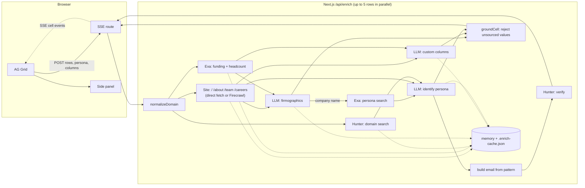

# Enrich

An agentic sales-enrichment spreadsheet. Paste company domains and an agent fills each row with firmographics and a persona contact email. Cells stream in live as it works. Every filled cell has a source URL and a confidence score; click a cell to see both, plus the quote that supports it.

## Quick start (free, no credit card)

1. **Get three free API keys:**
   - **Gemini:** https://aistudio.google.com/apikey (free tier, rate-limited)
   - **Exa:** https://dashboard.exa.ai/api-keys ($10 of free credit per month)
   - **Hunter:** https://hunter.io/api-keys (50 free credits per month, a few dozen rows)
2. **Install and configure:**
   ```bash
   npm install
   cp .env.example .env.local   # paste the 3 keys after the = signs
   npm run dev
   ```
3. **Open http://localhost:3000/demo** (10 YC B2B SaaS companies preloaded) and click **Run**.
   Or open http://localhost:3000, click the first Domain cell, and paste a list of domains.

### Before a live demo

The Gemini free tier allows about 10 requests a minute, so a cold run of the 10 demo rows takes about 2–3 minutes. **Run `/demo` once before the call.** Results are saved to `.enrich-cache.json`, so re-running during the call (even after restarting the server) replays the same real results instantly, at no cost and with no rate-limit risk.

Adding a **new** custom column during the call triggers fresh model calls: 10 rows take about a minute on the free tier.

## Features

- **Top bar:** persona (default "Head of Sales"), **+ Add column**, **Run** / **Stop**, **Export CSV**, and a row counter plus running cost.
- **Paste:** click a Domain cell and paste a column of domains, including from a spreadsheet. The domains fill rows from that cell down. They are normalized (`https://www.stripe.com/about` → `stripe.com`) and de-duplicated.
- **Row status dot:** grey means queued, pulsing blue means running, green means done, red means error. Hover for the error message or the row's cost.
- **Email status colors:** `verified` is green, `pattern_guessed` is amber, `not_found` is grey.
- **Side panel:** shows the value, a confidence bar, the source link, and the evidence quote.
- **Custom columns:** ask something like "Are they hiring SDRs?" and each row gets a sourced answer from the same scrape and search context.
- **CSV export:** includes each field's value, source, and confidence.

## Configuration

| Variable | Needed? | Purpose |
|---|---|---|
| `GEMINI_API_KEY` | one LLM key | Free Google Gemini (default `gemini-flash-latest`, rate-limited by `GEMINI_RPM`, default 10) |
| `ANTHROPIC_API_KEY` | one LLM key | Paid Claude (`claude-sonnet-5`). Used when set, unless `LLM_PROVIDER=gemini` |
| `EXA_API_KEY` | recommended | Search for funding news, headcount, and people. Without it, only the company site is used |
| `HUNTER_API_KEY` | recommended | Email pattern and verification. Without it, emails are `not_found` |
| `FIRECRAWL_API_KEY` | optional | Better scraping of JavaScript-heavy sites. Without it, pages are fetched directly |
| `ENRICH_CONCURRENCY` | optional | Domains processed in parallel (default 5) |
| `ENRICH_MAX_PAGE_CHARS` | optional | Characters kept per scraped page (default 12000) |
| `ENRICH_DISK_CACHE` | optional | `0` turns off the `.enrich-cache.json` replay cache |

`GET /api/enrich` reports which keys the server can see. The UI shows a banner if any are missing.

## CLI and tests

```bash
npm run enrich -- stripe.com                                   # one domain, streamed to the terminal
npm run enrich -- linear.app --persona "VP Marketing" --ask "Are they hiring SDRs?"
npm run test:pipeline                                          # offline tests, all APIs mocked, both LLM modes
```

## Architecture



- **`lib/enrich/pipeline.ts`** runs each domain and emits `row_status`, `cell`, `row_cost`, and `log` events. The SSE route (`app/api/enrich/route.ts`) forwards them unchanged, and the grid batches them into one render per animation frame.
- **`lib/enrich/providers.ts`** makes structured JSON calls with a Zod schema. Claude uses `messages.parse` with structured outputs; Gemini uses `responseJsonSchema`, spaced to stay under the free tier's requests-per-minute limit.
- **Grounding:** the model may only cite the documents it was given. `groundCell` drops any value whose `source_url` isn't one of those documents, and lowers confidence when the evidence quote can't be found in the cited page. Anything unsupported comes back `null`.
- **Email status:** Hunter says `valid` → `verified`. Built from the domain's pattern (or indexed by Hunter) but not confirmed → `pattern_guessed`. No name, no pattern, or Hunter says `invalid` → `not_found`.
- **Reliability:** Exa, Hunter, and scrape calls retry twice with exponential backoff; Gemini retries three times with longer waits for free-tier 429s. The Anthropic SDK retries on its own.
- **Caching:** scrapes, searches, Hunter lookups, and LLM results are cached for 24h in memory and on disk. LLM results are keyed by a hash of the full prompt, so changing the persona or a question only re-runs what changed.
- **Cost logging:** every LLM call logs `[tokens]` to the server console, and every row logs a `[cost]` line. Gemini's free tier counts as $0.

## Known limitations

- **Direct fetch misses client-rendered content.** Sites that render with JavaScript may yield thin pages. Set `FIRECRAWL_API_KEY` to fix this.
- **Free-tier limits.** Gemini allows about 10 requests a minute, and each row makes 2–3 calls. Hunter's 50 monthly credits cover a few dozen rows (each row uses one domain search and at most one verification; check Hunter's dashboard for exact credit costs). Exa's $10 of free credit covers a few hundred rows (4 searches per row).
- **Personas depend on public sources.** If Exa, the team page, and Hunter's index don't name the person, the persona cells stay empty and the email is `not_found`.
- **Pattern-guessed emails cite Hunter's domain page** (`hunter.io/search/<domain>`) as their source, because the address is constructed rather than found. Catch-all domains return `accept_all` and stay `pattern_guessed`.
- **The cache is per machine.** `.enrich-cache.json` is local (and gitignored). Cached results can be up to 24h old.
- **Gemini free-tier data use.** Google may use free-tier requests to improve its models. The inputs here are public web pages, but keep that in mind before sending anything private.
- **Stop is cooperative.** Rows already in progress on the server finish (and get cached); queued rows are skipped.
