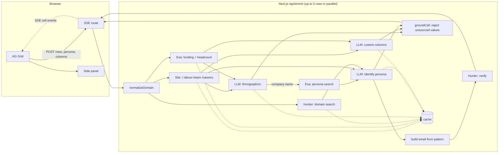

# Enrich

An agentic sales-enrichment spreadsheet. Paste company domains and an agent fills each row with firmographics and a persona contact email, streaming cells in live. Every filled cell has a source URL, a confidence score, and the quote that supports it.

## Run it

```bash
npm install
cp .env.example .env.local   # add GEMINI_API_KEY, EXA_API_KEY, HUNTER_API_KEY (all free)
npm run dev
```

Open http://localhost:3000/demo (10 YC B2B SaaS companies preloaded) and click **Run**.

## Features

- **Paste domains** into the Domain column. They're normalized (`https://www.stripe.com/about` → `stripe.com`) and de-duplicated.
- **Live streaming:** cells fill in as each field resolves, with a status dot on each row (queued, running, done, error).
- **Sourced cells:** click any cell for its value, confidence, source link, and evidence quote.
- **Persona emails:** set a target persona (default "Head of Sales") to get the person's name, title, and email. Email status is color-coded: `verified`, `pattern_guessed`, or `not_found`.
- **Custom columns:** ask a question like "Are they hiring SDRs?" and every row gets a sourced answer. The agent also checks the company's open roles on Ashby, Greenhouse, or Lever.
- **Export CSV** with each field's value, source, and confidence.

## Architecture



- **Stack:** Next.js 14, TypeScript, Tailwind, AG Grid, Server-Sent Events. Gemini (free) or Claude for extraction, Exa for search, Hunter for emails.
- **Structured extraction:** the LLM returns strict JSON (Zod schema) with a value, source URL, confidence, and quote for every field.
- **Grounding:** a value is dropped if its source isn't a page the agent actually read, and confidence drops if the quote isn't on that page. Unsupported fields stay empty instead of guessed.
- **Email status:** Hunter confirms the address → `verified`. Built from the domain's email pattern but unconfirmed → `pattern_guessed`. Otherwise → `not_found`.
- **Reliability and cost:** failed API calls retry with backoff. Results are cached in memory and on disk, so re-runs are instant. Token usage and cost are logged per row.
