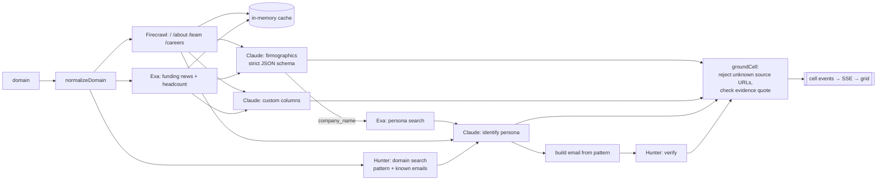

# Enrich

An agentic sales-enrichment spreadsheet. Paste company domains, and an agent fills each row with firmographics and a persona contact email. Every filled cell carries a `source_url` and a `confidence` score.

> **Status:** the project scaffold and enrichment pipeline are done and can be run from the CLI. The spreadsheet UI (AG Grid, SSE streaming, custom columns, `/demo`) comes next.

## Setup

```bash
npm install
cp .env.example .env.local   # then fill in the keys
```

| Variable | Required | Purpose |
|---|---|---|
| `ANTHROPIC_API_KEY` | yes | Claude, for extraction and reasoning |
| `FIRECRAWL_API_KEY` | yes | Scrapes the company site |
| `EXA_API_KEY` | yes | Web search for funding, headcount, and people |
| `HUNTER_API_KEY` | yes | Email pattern and verification |
| `ANTHROPIC_MODEL` | no | Defaults to `claude-sonnet-5` |
| `ANTHROPIC_EFFORT` | no | `low` / `medium` / `high`. Defaults to `medium` |
| `ENRICH_CONCURRENCY` | no | Number of domains processed in parallel. Defaults to 5 |
| `ENRICH_MAX_PAGE_CHARS` | no | Maximum characters of markdown kept per scraped page. Defaults to 12000 |
| `FIRECRAWL_API_URL` | no | Defaults to `https://api.firecrawl.dev/v2` |

## Test the pipeline on one domain

```bash
npm run enrich -- stripe.com
npm run enrich -- https://www.linear.app/about --persona "VP Marketing" --ask "Are they hiring SDRs?"
npm run enrich -- ramp.com --json        # full event stream plus cells as JSON
npm run test:pipeline                    # offline test with every API mocked
```

Cells print as they resolve. At the end the script prints a per-field report (value, source, confidence, evidence quote) and the row's cost.

## Architecture



- `lib/enrich/pipeline.ts` runs one domain end to end (`enrichDomain`) or many with bounded concurrency (`enrichMany`). It emits `row_status`, `cell`, `row_cost`, and `log` events. The upcoming SSE route will forward these events unchanged.
- `lib/enrich/llm.ts` makes the Claude calls through `messages.parse` with Zod structured outputs. Each field is `{ value, source_url, evidence, confidence }`.
- **Grounding:** `groundCell` drops any value whose `source_url` isn't one of the documents actually given to the model. If the evidence quote can't be found in the cited document, it lowers the confidence. Claude is told to return `null` rather than guess.
- **Email status:** Hunter returns `valid` → `verified`. Built from the pattern or indexed by Hunter but not confirmed → `pattern_guessed`. No name, no pattern, or Hunter returns `invalid` → `not_found`.
- **Reliability:** each Firecrawl, Exa, or Hunter call is retried twice with exponential backoff on 408, 429, 5xx, and network errors. The Anthropic SDK retries twice on its own. Scrape, search, and Hunter results are cached in memory per URL, query, or domain for 6 hours, so re-runs are fast.
- **Cost logging:** each Claude call logs `[tokens]`. Each row logs a `[cost]` line with LLM dollars and the number of uncached API calls.

## Known limitations (so far)

- The cache is per process and in memory. It is lost on restart and not shared across serverless instances.
- Scraped pages are cut to `ENRICH_MAX_PAGE_CHARS`. Facts that appear only deep in a long page can be missed.
- The persona is whoever the sources name. If Exa or the team page doesn't list the person, the persona cells are `null` and the email is `not_found`.
- Pattern-guessed emails cite Hunter's domain page (`hunter.io/search/<domain>`) as their source, because the address itself is constructed, not found.
- Hunter's verifier returns `accept_all` for catch-all domains. Those addresses stay `pattern_guessed`, never `verified`.
